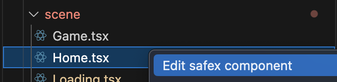
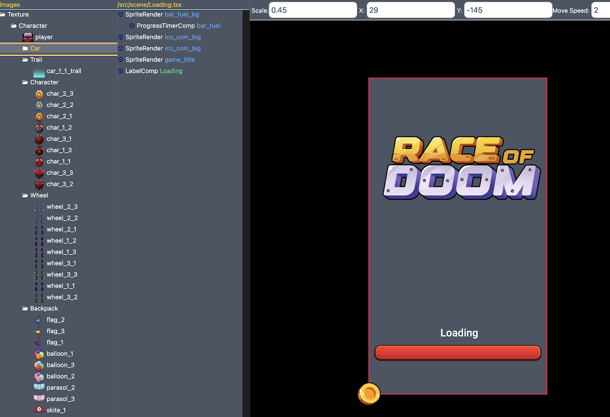

# 🖼️ Safex editor for VS Code

A Visual Studio Code extension that help moving and edit scene in safex game:

---

## 🚀 Features

- **Load Components File**  
  Right-click on a folder or in the Explorer and load `.tsx` file component to edits.
  

- **Moving and edit**  
  Left-click on a tree node and moving node to edit scene.
  

- **Keys Binding**  
- Ctrl/Cmd + S: Save scene
- X: Lock/Unlock move X
- Y: Lock/Unlock move Y
- Arrow keys: Move by 1px
- Shift + Arrow keys: Move by 10px
---

## 📦 Installation

Search for **`Safex editor`** in the [VS Code Extensions Marketplace](https://marketplace.visualstudio.com/) and click **Install**, or use the command line:

```bash
code --install-extension antn9x.safex-editor
